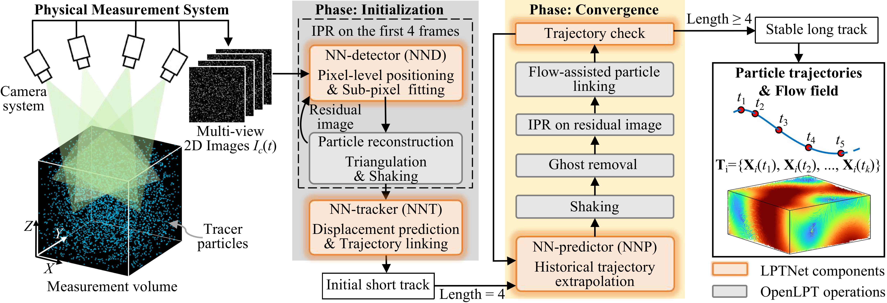

# LPTNet

LPTNet is a neural-network-enhanced Lagrangian particle tracking (LPT) framework for volumetric flow measurement.
It builds upon the [OpenLPT](https://github.com/JHU-NI-LAB/OpenLPT_GUI.git) pipeline and introduces learning-based modules for particle localization, particle association, and trajectory prediction. The goal is to improve the robustness of particle reconstruction and trajectory tracking under challenging experimental conditions, such as high seeding density, large inter-frame displacement, and nonlinear particle motion.

This repository contains both Python-based neural network modules and modified C++ components derived from OpenLPT.

---

## Overview

LPTNet connects neural-network-based particle detection and tracking modules with the OpenLPT reconstruction backend.

- Neural-network-based 2D particle localization for overlapping particle images.
- Graph-based particle association for large-displacement tracking.
- Recurrent trajectory prediction for nonlinear particle motion.
- Python implementation of the main STB workflow, including particle association, trajectory management, and checking.
- Segmented / polyline-based line-of-sight projection in stereo matching, allowing the reconstruction pipeline to better handle distorted experimental imaging geometries.
- Support for passing neural-network-predicted particle centers, diameters, and intensities from Python into the modified OpenLPT backend.
- Modular design for testing, replacing, and extending learning-based components in the LPT workflow.



---


## Model Architecture

LPTNet consists of several learning-based components and a modified OpenLPT backend. The learning-based modules can be used together in the full pipeline or tested independently.

| Module | Purpose |
|---|---|
| `NN_detec/` | Hybrid 2D particle localization module. A CNN-based detector is used for raw particle images, while max-pooling-based peak extraction is used for residual images. |
| `GOTrack3D/` | 3D implementation of [GOTrack](https://github.com/wuwuwuas/GOTrack) for particle linking. The pretrained model is from [GotFlow3D](https://github.com/JiamingSkGrey/GotFlow3D). |
| `NN_pred/` | Recurrent trajectory prediction module for nonlinear particle motion. |
| Modified OpenLPT backend | C++ backend for 3D reconstruction, stereo matching, Shake refinement, residual image computation, and Python/C++ data exchange. |


---

## Relationship to OpenLPT

This work is based on [OpenLPT](https://github.com/JHU-NI-LAB/OpenLPT_GUI.git). We sincerely acknowledge the OpenLPT developers for making their source code publicly available.

In addition to the Python-side neural network modules, several low-level C++ components of OpenLPT were modified to support the LPTNet workflow.
These modifications mainly serve the following purposes:

- allow externally detected 2D particle coordinates to be passed into the reconstruction pipeline;
- preserve neural-network-predicted particle diameter and intensity information;
- support Python/C++ data exchange between neural network modules and OpenLPT routines;
- extend stereo matching with an optional segmented / polyline-based search mode;
- support Shake-based residual image computation using neural-network-derived particle information;
- expose combined C++ reconstruction/refinement routines to Python.

Detailed explanations of the C++ modifications, including the motivation and affected source files, are provided in:

```text
docs/lptnet_modifications.md
```

---

## Installation

### 1. Prepare the OpenLPT backend

LPTNet is built upon the OpenLPT `v2.1.3` backend. Please first download the original OpenLPT project and make sure that the unmodified OpenLPT C++/Python backend can be compiled successfully on your system.

After the original OpenLPT backend has been verified, replace the corresponding backend files with the modified LPTNet components and rebuild the package.

#### Ubuntu/Linux

On Ubuntu or other Linux systems, replace the original `src` and `inc` directories in OpenLPT with the modified `src` and `inc` directories provided by LPTNet. Then rebuild OpenLPT:

```
rm -rf build dist openlpt.egg-info
pip install .
```

#### Windows

On Windows, replace the modified backend files in `src` and `inc`, but keep the original `inc/libtiff/tif_unix.c` file from OpenLPT. The Linux version of this file may include Unix-specific headers such as unistd.h, which are not available when compiling with MSVC on Windows.

Before rebuilding on Windows, it is recommended to enable UTF-8 compilation for MSVC to avoid source-code parsing issues caused by non-ASCII comments or encoding mismatches:

```
set CL=/utf-8
rmdir /s /q build
pip install .
```

### 2. Install PyTorch

The current environment was tested with PyTorch 2.0.1 and CUDA 11.8:

```
pip install torch==2.0.1+cu118 torchvision==0.15.2+cu118 torchaudio==2.0.2+cu118 --index-url https://download.pytorch.org/whl/cu118
```
Some dependencies may install NumPy 2.x by default, which can cause compatibility issues with PyTorch 2.0.1 and the OpenLPT/LPTNet backend. We recommend using NumPy 1.26.4:

```
pip uninstall numpy -y
pip install numpy==1.26.4
```
If pip reports a dependency conflict with opencv-python, this usually means that the installed OpenCV package requires NumPy 2.x. The warning can be ignored if the code runs correctly. Alternatively, install an OpenCV version compatible with NumPy 1.x.

With the above environment, LPTNet can run with the NND and NNP modules. To use the NNT module, `torch-scatter` should be installed additionally:

```
pip install torch-scatter -f https://data.pyg.org/whl/torch-2.0.1+cu118.html
```


After installing `torch-scatter`, the full LPTNet framework, including NND, NNT, and NNP, can be used.


### 3. Install additional dependencies

Some additional Python packages are required for data loading and intermediate result processing. 

```
pip install pyarrow
```

---

## Usage

Several test cases are provided to demonstrate the LPTNet workflow.
The time-resolved Arnold-Beltrami-Childress (ABC) flow cases are provided at two image particle densities:

```text
./test/ABC_TR_0.01ppp
./test/ABC_TR_0.05ppp
```

The time-resolved isotropic turbulence cases, synthesized from the [Johns Hopkins Turbulence Database (JHTDB)](https://turbulence.idies.jhu.edu/datasets/homogeneousTurbulence/isotropic), are provided at three image particle densities:
```
./test/ISO_TR_0.01ppp
./test/ISO_TR_0.05ppp
./test/ISO_TR_0.075ppp
```
Before running the tracking scripts, please first generate the image-path files using:
```
python ./demo/img_path.py
```
After the image paths are prepared, LPTNet can be tested in both two-pulse and time-resolved tracking modes:
```
python ./demo/test_LPTNet_TP.py
python ./demo/test_LPTNet_TR.py
```
For comparison with the original OpenLPT workflow, the conventional STB-based tracking pipeline can be tested using:
```
python ./demo/test_STB_C.py
```


## Notes on C++ Modifications

Because LPTNet is integrated with the OpenLPT workflow, several C++ modifications were necessary. These changes enable smoother interaction between neural network outputs and the original reconstruction/tracking pipeline.

The modifications mainly affect:

- configuration and object data structures;
- object detection interfaces;
- stereo matching;
- Shake refinement and residual image computation;
- Python bindings;
- matrix data exchange;
- TIFF I/O compatibility.

For clarity and maintainability, the detailed motivation, implementation choices, and modified files are documented separately in:

```text
docs/lptnet_modifications.md
```

---

## Acknowledgments

This project builds upon OpenLPT. We sincerely thank the OpenLPT developers for publicly sharing their source code and for their contributions to the particle tracking community.

Please cite the original OpenLPT work when using components derived from OpenLPT.

---

## License

The license for this repository will be specified before release.

Please also refer to the original OpenLPT license when using or modifying components derived from OpenLPT.

---

## Contact

For questions or suggestions, please open an issue in this repository or contact the authors (zhi_wang@zju.edu.cn or zwangncepu@126.com).